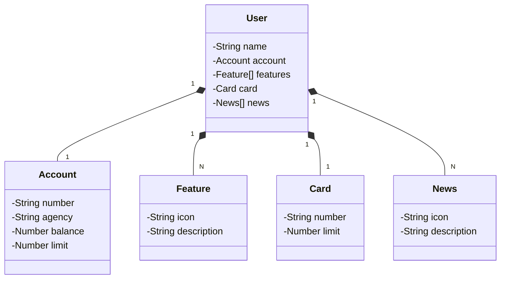

# Publicando Sua API REST na Nuvem Usando Spring Boot 3, Java 17 e Railway

## Sobre o Projeto
Este projeto demonstra como criar e publicar uma API REST na nuvem utilizando Spring Boot 3, Java 17 e a plataforma Railway. A API fornece endpoints para algumas das operações CRUD.

## Tecnologias Utilizadas
- **Java 17**
- **Spring Boot 3**
- **Swagger**
- **Banco de Dados PostgreSQL**
- **Railway**

## Diagrama de Classes

## Endpoints
- **GET /users/{id}** - Busca uma conta por ID
- **POST /users** - Cria um nova conta
  
## Acesso à API
https://api-rest-diodecola-production.up.railway.app/swagger-ui/index.html#/
